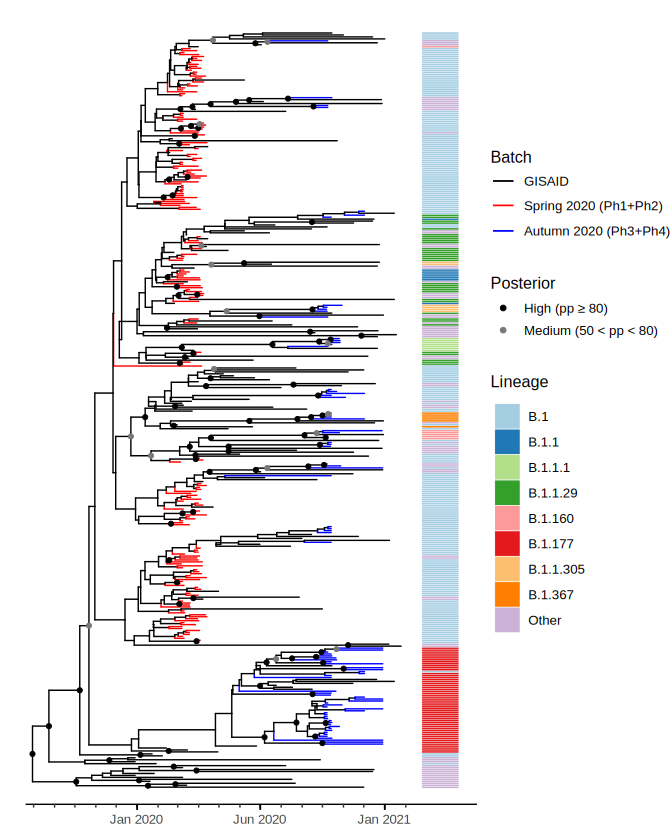

# COVID-19_TN
Tracking the first two waves of SARS-CoV-2 in the province of Trento 

## Description
This repository contains all my scripts and analysis for the paper titled "On the Origin and Propagation of the COVID-19 Outbreak in the Italian Province of Trento, a Tourist Region of Northern Italy" (published on MDPI and available at https://www.mdpi.com/1999-4915/14/3/580).

## Reconstructing phylogenies with only a few mutations
